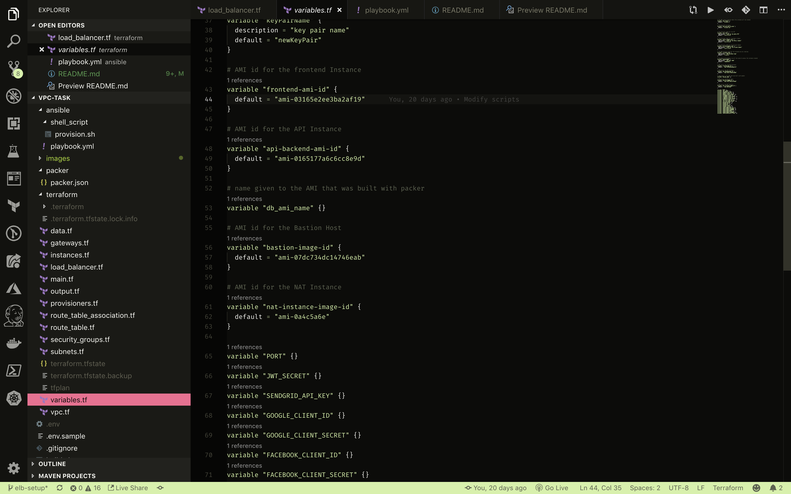
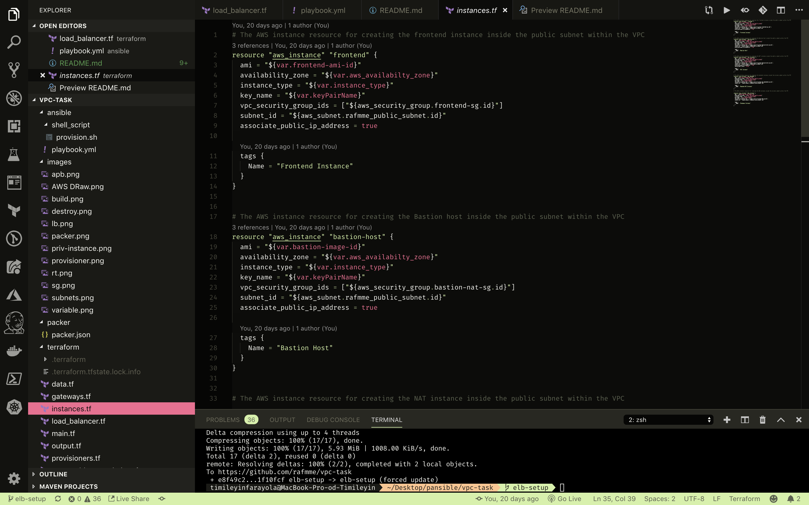
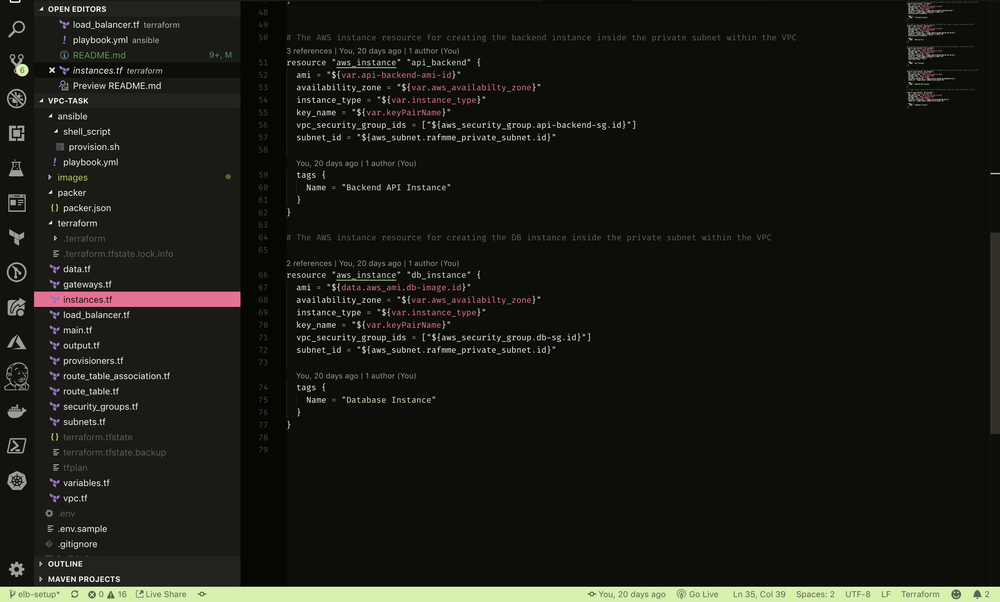
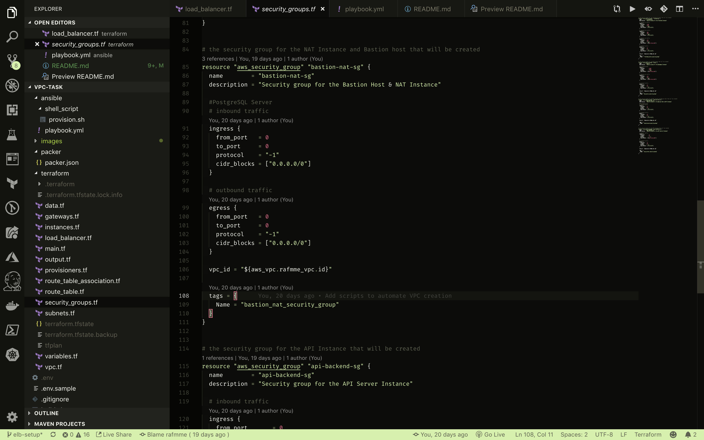
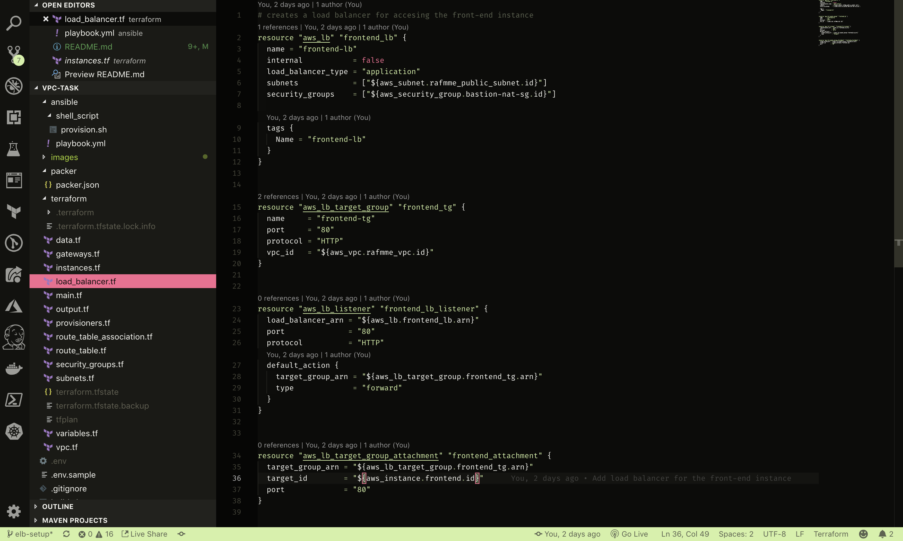

# Creating a Custom Network (VPC)


---------------------------------------------------------------------------------------------------------------------------


### Technology and Platforms Used

- [Packer](https://www.packer.io/docs/index.html) 
- [Ansible](https://docs.ansible.com/ansible/latest/index.html)
- [Terraform](https://www.terraform.io/docs/index.html)
- [AWS](aws.amazon.com)

---------------------------------------------------------------------------------------------------------------------------

## Introduction
This repository contains scripts (IAC) that automates the creation of a VPC and Instances as shown in the image above on AWS with two subnets (Public & Private Subnet) with Terraform. The API backend instance and DB instance for the application will be placed in the Private Subnets while the frontend instance, Bastion Host and NAT Instance are placed in the Public Subnet. The frontend instance can be accessed via a Load Balancer.

---------------------------------------------------------------------------------------------------------------------------


## How the scripts work
  - The following variables were added to the .env file at the root directory for this project. The scripts sources for the variables from the .env file for the automation process.
    ```
        export AWS_ACCESS_KEY_ID='XXXXXXXXXXXXXXXXXXXX'
        export AWS_SECRET_ACCESS_KEY='XXXXXXXXXXXXXXXXXXXXXX'
        export REGION='eu-west-2'
        export DB_AMI_NAME=db-image
        export TF_VAR_db_ami_name=$DB_AMI_NAME
        export TF_VAR_PORT=4000
        export TF_VAR_JWT_SECRET='secret'
        export TF_VAR_SENDGRID_API_KEY='XXXXXXXXXXXXXXXXXXXXXXX'
        export TF_VAR_GOOGLE_CLIENT_ID='XXXXXXXXXXXXXXXXXXXXXXX'
        export TF_VAR_GOOGLE_CLIENT_SECRET='XXXXXXXXXXXXXXXXXXXXXXX'
        export TF_VAR_FACEBOOK_CLIENT_ID='XXXXXXXXXXXXXXXXXXXXXXX'
        export TF_VAR_FACEBOOK_CLIENT_SECRET='XXXXXXXXXXXXXXXXXXXXXXX'
        export TF_VAR_LINKEDIN_CLIENT_ID='XXXXXXXXXXXXXXXXXXXXXXX'
        export TF_VAR_LINKEDIN_CLIENT_SECRET='XXXXXXXXXXXXXXXXXXXXXXX'
        export TF_VAR_TWITTER_CLIENT_ID='XXXXXXXXXXXXXXXXXXXXXXX'
        export TF_VAR_TWITTER_CLIENT_SECRET='XXXXXXXXXXXXXXXXXXXXXXX'
        export TF_VAR_SESSION_SECRET='secre'
        export TF_VAR_PUSHER_APP_ID='XXXXXXXXXXXXXXXXXXXXXXX'
        export TF_VAR_PUSHER_KEY='XXXXXXXXXXXXXXXXXXXXXXX'
        export TF_VAR_PUSHER_SECRET='XXXXXXXXXXXXXXXXXXXXXXX
        export TF_VAR_SUPER_ADMIN_ROLE_ID='XXXXXXXXXXXXXXXXXXXXXXX'
        export TF_VAR_SUPER_ADMIN_FULLNAME='Super Admin'
        export TF_VAR_SUPER_ADMIN_USERNAME='super-Admin'
        export TF_VAR_SUPER_ADMIN_EMAIL='superAdmin@nah.com'
        export TF_VAR_SUPER_ADMIN_PASSWORD='XXXXXXXXXXXXXXXXXXXXXXX'
        export TF_VAR_SUPER_ADMIN_AUTHTYPEID='XXXXXXXXXXXXXXXXXXXXXXX'
    ```
  - The next thing to do is to provision the AMI (Image) for the application's Database using Packer and Ansible. The image below shows the Ansible playbook for setting up Postgres DB for the project inside the AMI on AWS.
  
  In the `packer` directory, there is a `packer.json` file that provisions the AMI using AWS. In the `provisioners` part of the file, a shell script is used to install Ansible before the using the playbook file to provision the DB. To run build the AMI, run `cd packer` to change directory to the `packer` folder and run `packer build packer.json`.
  ```
            
            ## Content of the provision script that installs Ansible ##

            #!/usr/bin/env bash
            function add_ansible() {
                sudo apt-get update
                sudo apt-get install software-properties-common
                sudo apt-add-repository --yes --update ppa:ansible/ansible
                sudo apt-get install ansible -y
            }
            function main {
                add_ansible
            }


            main
```
  

  ________________________

  - After building the AMI, the next step is to create the infrastucture using Terraform (IAC). In the `terraform` directory, there are terraform scripts that contains the infrastructure as codes.
    - In the `variables.tf` file, the variables needed for the creation of the infrastructure were defined. For example line 37 - 40 shows the variable declaration for the key pair filename for ssh access to the instances created.
    

    - In the `main.tf` file, the cloud provider that the infrastructure will be created on and the region sourced from a defined variable was specified which is AWS.
        ```
           ## main.tf file content ##

            provider "aws" {
                region = "${var.aws_region}"
            }
        ```
    - `gateways.tf` file contains the code that creates an internet gateway that allows communication between instances in the VPC and the internet.
        ```
           ## gateways.tf file content ##

          resource "aws_internet_gateway" "rafmme_vpc_igw" {
            vpc_id = "${aws_vpc.rafmme_vpc.id}"

            tags = {
                Name = "Rafmme IGW"
            }     
          }
        ```

    - `vpc.tf` file contains the code that creates the virtual private cloud (VPC) that is logically isolated from other virtual networks in the AWS Cloud.
        ```
           ## vpc.tf file content ##

          resource "aws_vpc" "rafmme_vpc" {
          cidr_block = "${var.vpc_cidr}"
          enable_dns_hostnames = true
          tags {
            Name = "Rafmme VPC"
          }
        }
       ```

    -  `instances.tf` file contains code that creates and launches the AWS EC2 instances into private and public subnet
                
                

    - `security_groups.tf` file contains the code that creates the various security groups. security group acts as a virtual firewall to control the traffic for its associated instances. In the security group code, there are the inbound rules to control incoming traffic to the instances, and outbound rules to control the outgoing traffic from the instances.
        

    - `route_table.tf` file contains the code that creates the route tables that are associated to the public and private subnets, and it contains a set of rules, called routes, that are used to determine where network traffic is directed. The table controls the routing for the subnets.
        

    - `route_table_association.tf` file contains the code that associates the subnets to their respective route tables.
        ```
                    ## route_table_association.tf file content ##

                    resource "aws_route_table_association" "rafmme_private_rt_association" {
                        subnet_id = "${aws_subnet.rafmme_private_subnet.id}" 
                        route_table_id = "${aws_route_table.rafmme_vpc_private_rtable.id}"
                    }


                    resource "aws_route_table_association" "rafmme_public_rt_association" {
                        subnet_id = "${aws_subnet.rafmme_public_subnet.id}"
                        route_table_id = "${aws_route_table.rafmme_vpc_public_rtable.id}"
                    }
        ```

    - `subnets.tf` file contains the code that creates the private and public subnets inside the vpc created. A subnet is a range of IP addresses in a VPC.
            

    - `load_balancer.tf` file contains code that creates the application load balancer for the frontend instance
            

---------------------------------------------------------------------------------------------------------------------------
  ## How To Run the Automation process
To start the automation process, while on the terminal `cd` to this project's directory and run the following commands on the CLI.
            
            chmod u+x ./build.sh
            ./build.sh
Also to clean up and delete resources created, run the following commands on the CLI.
            
            chmod u+x ./destroy.sh
            ./destroy.sh

---------------------------------------------------------------------------------------------------------------------------
